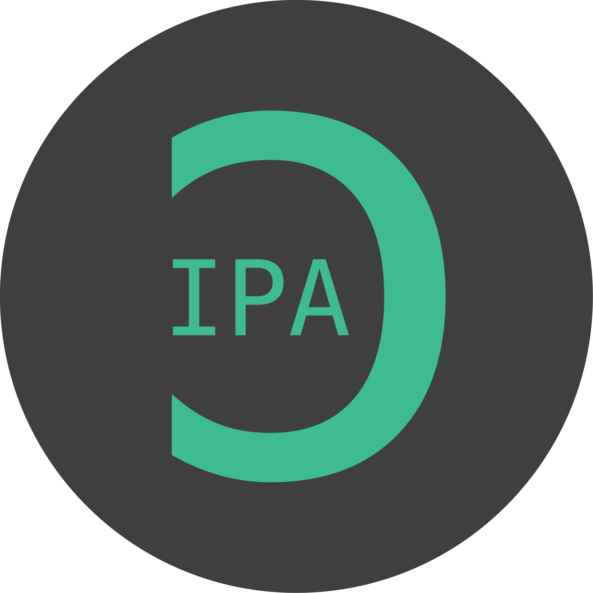
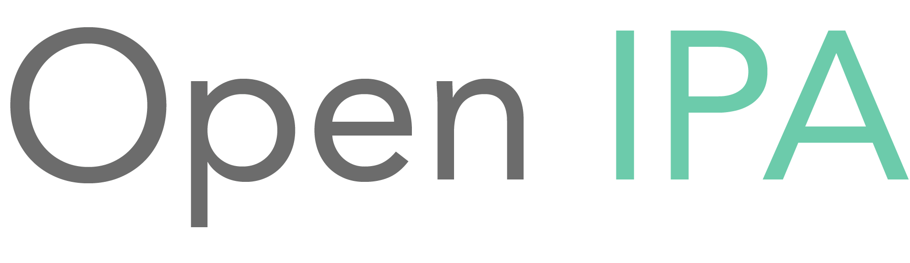

<a href="https://www.openipa.org">

  

<h1 align='center'>
  
</h1>
</a>

### What is Open IPA?
Open IPA is a free, fast, community-focused transcription tool to transcribe texts in Latin, French, German, and Italian into IPA (International Phonetic Alphabet). OpenIPA transcribes text in real-time, and provides in-depth transcription feedback for each letter or group of letters transcribed.
